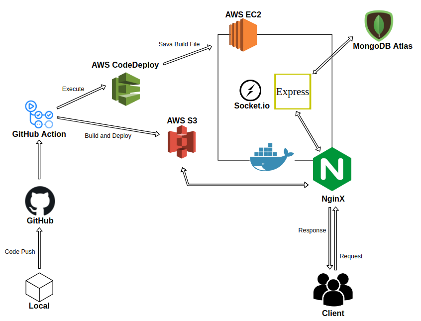
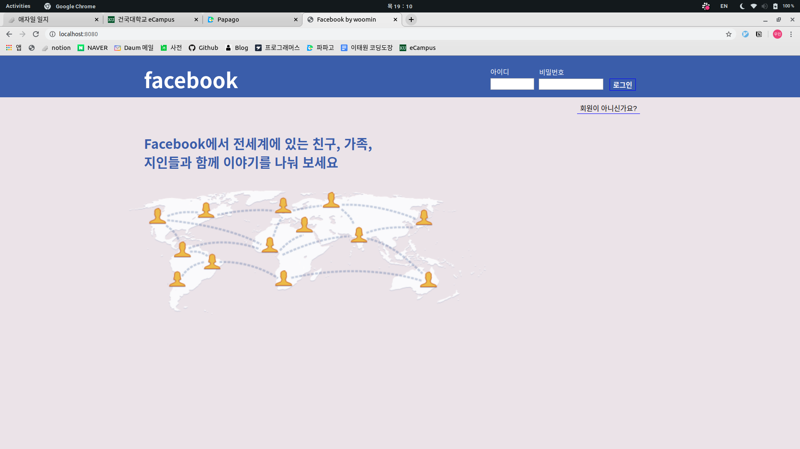
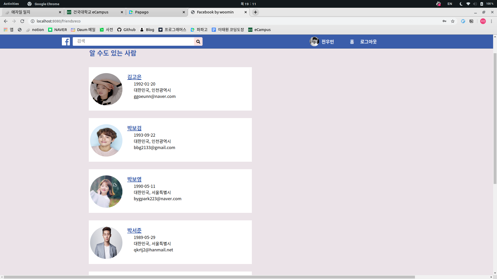

# Facebook

웹 사이트 URL : http://woomin-facebook.com
테스트 유저 ⇒ 아이디: test / 비밀번호: test

<br />

## 프로젝트 소개

2020.02.02 ~ 2020.04.21  
Facebook을 클론 코딩하면서 JavaScript 와 React, Express(NodeJS), HTTP 와 Web 전반에 대해서 학습한 프로젝트입니다. 전반적인 웹 애플리케이션의 개발 과정을 습득하고, Docker 와 클라우드를 이용한 배포 과정도 체험했습니다. 또한 API Test coverage 100% 를 달성하는 과정에서 책에서 봤던 설계의 중요성을 몸소 느낀 프로젝트입니다.

<br />

## 프로젝트 실행 방법

FrontEnd

```javascript
$ git clone git@github.com:Woomin-Jeon/facebook-clone-client.git
$ npm install
$ npm start
```

Api ([README here](https://github.com/Woomin-Jeon/facebook-clone-server))

```javascript
$ git clone git@github.com:Woomin-Jeon/facebook-clone-server.git
$ npm install
$ npm start
```

<br />

## 테스트

```javascript
$ npm test
```

<br />
<br />

## 프로젝트 서비스 구성도



<br />
<br />

## 웹 사이트 화면

|                 로그인                |               가입하기                |
| :-----------------------------------: | :-----------------------------------: |
|     |    |

|               타임라인                |                타임라인               |
| :-----------------------------------: | :-----------------------------------: |
|  |   |

|                1:1 채팅               |               유저 페이지             |
| :-----------------------------------: | :-----------------------------------: |
|  |  |

|               친구 추천               |                 팔로잉                |
| :-----------------------------------: | :-----------------------------------: |
|  |  |

<br />

## 구현한 기능

- 로그인 / 로그아웃  
- 회원가입 및 팔로잉  
- 게시글 불러오기 / 업로드(사진) / 수정 / 삭제  
- 게시글에 대한 좋아요와 댓글, 대댓글  
- 친구 목록  
- 친구 추천  
- socket.io를 이용한 1:1 채팅  
- 유저 페이지 / 마이 페이지  

<br />

## 사용 기술

| **FrontEnd** |                |
| ---------------- | -------------- |
| **ReactJS**      | UI 라이브러리  |
| **React-Router** | 라우팅         |
| **Webpack**      | 번들링         |
| **Axios**        | API 요청       |
<br />

| **BackEnd**     |                |
| ---------------- | -------------- |
| **Express**      | API 라이브러리 |
| **MongoDB**      | DataBase       |
| **Sentry**       | 에러 관리      |
| **Winston**      | 에러 로깅      |
<br />

| **Test**     |                  |
| ---------------- | ---------------- |
| **Jest**         | Unit test        |
| **Supertest**    | Integration test |
| **Enzyme**       | React component test |

<br />

## 배포

|                  |         |
| ---------------- | ------- |
| **클라이언트**   | AWS S3  |
| **API 서버**     | AWS EC2 - Docker |
| **채팅 서버**    | AWS EC2 - Docker |
| **MongoDB**      | Atlas   |
| **이미지 파일**  | AWS S3  |

<br />

## 프로젝트를 통해 알게된 것

1. React를 이용한 UI 구현에 대해서 알게되었습니다. 기존의 JavaScript로 구현하는 렌더링보다 더욱 효율적이고, 직관적으로 렌더링하기 위해서 React를 공부하였고, 이를 이용하여 프론트엔드를 구현하였습니다.
2. React-Router를 이용한 라우팅에 대해 알게되었습니다. 어떻게 페이지를 새로고침하지 않으면서 다른 페이지로 이동할 수 있을까를 고민하다가 React-Router를 이용하여 이를 해결하였습니다.
3. React에서 상태를 관리하는 방법에 대한 필요성을 알게되었습니다. 이번 프로젝트에서는 Redux나 MobX 같은 상태관리 라이브러리를 사용하지 않았었기 때문에 상태를 전달하고자 최상위 컴포넌트로 상태를 끌어올리고, 다시 다른 자식으로 주입시키는 방식을 사용하였습니다. 이렇게 되면 상태의 전달 과정도 복잡하고 상태관리에 있어서도 불편함을 깨달았습니다. 그렇기 때문에 다음 프로젝트부터는 상태관리 라이브러리를 사용해볼 생각입니다.
4. NodeJS Express를 사용하여 API 서버를 구현하는 방법에 대해 알게되었습니다. 프론트엔드를 어느정도 구성해놓은 상태에서 API 서버를 붙였습니다. 이 과정에서 이미 프론트엔드 단에서 만들어놓았던 로직들을 서버로 다시 단순반복 작업을 통해 옮겨야했습니다. 너무 불편했고, 다음 프로젝트부터는 프론트엔드와 서버를 같이 만들어 나가야겠습니다.
5. Session Cookie에 대해 알게되었습니다. 유저가 로그인을 했을 때, 서버에서 Session을 주고, 유저는 이 Session이 있는 경우 request로 서버에 Session ID를 전달함으로써 로그인 상태를 유지할 수 있었습니다. 이 과정에서 서로 다른 도메인 간의 cookie를 저장 할 수 없는 문제가 발생해서, webpack-dev-server의 proxy를 활용함으로써 해결하였습니다.
6. DB에 대해서 알게되었습니다. 원래는 클라이언트에서 생성한 정보를 서버에 저장해두었었는데, 이렇게 되면 서버가 죽었을 경우 데이터가 보존되지 않는다는 문제점이 있었습니다. 이를 해결하고자 MongoDB를 사용하였고, 이제 데이터들을 DB에 저장하며 서버는 DB에 정보를 요청하도록 구현하였습니다.
7. 이미지 업로드에 대해 알게되었습니다. 원래는 클라이언트에서 이미지 파일을 request로 보내면 서버에서 express-fileupoad라는 라이브러리를 사용해서 이미지를 서버에 저장했었습니다. 하지만 일반적으로 이미지 파일은 서버에 저장하기보다는 따로 관리한다는 정보를 접하고, AWS S3에서 이미지 파일을 따로 관리하도록 로직을 변경하였습니다.
8. Socket.io를 활용한 채팅 기능을 구현해보았습니다. 어떻게 상대를 특정해서 메세지를 전달하느냐가 고민거리였습니다. 처음에는 broadcast로 모든 사용자에게 메세지를 보내고, 해당 사용자가 맞다면 메세지를 수령, 아니면 무시하도록 로직을 구현했었었는데, 이렇게 되면 쓸데없는 네트워크 통신이 발생하게 되어 문제가 있었습니다. 그렇기 때문에 사용자들이 로그인 할 때 마다 해당 socket ID를 서버에 따로 저장해두고, 이를 활용해서 상대방을 특정하여 메세지를 보내도록 하였습니다.
9. CORS가 무엇인지 알게되었고, 제 프로젝트에서 CORS Error가 왜 발생하는지 알게되었습니다. 그리고 cors 라이브러리를 설정한 뒤, 옵션으로 origin을 설정해줌으로써 해결하였습니다.
10. 테스트 코드의 중요성에 대해 알게되었습니다. 저는 코드를 다 짠 뒤에 테스트 코드르 붙였었는데, 테스트 코드를 짜기 위해서는 함수 하나에 가능한한 하나의 책임만이 있어야 했고, 이를 위해 제 코드들을 리펙토링 하였습니다. 그리고 리펙토링 과정에서 어떻게 하면 역할이 분명한 코드들을 짤 수 있을까 고민하게 되었고, 코드의 아키텍쳐적인 측면에 흥미가 생겼습니다. 다음 프로젝트부터는 코드의 설계에 대해 공부를 해보고, 재사용 가능한 코드를 만들어보도록 노력할 것입니다. 또한, 테스트 코드를 먼저 작성한 뒤 이에 맞는 코드를 짜는 TDD를 통해 코드를 짜도록 할 것입니다.
11. Docker에 대해 알게되었습니다. 배포할 때 AWS EC2에 Docker를 두 개 띄워서 하나는 API 서버, 하나는 socket.io를 서버를 띄웠습니다. 로컬에서 제작한 코드에서 Docker Image를 만들고, Docker Hub로 올리고, 이를 EC2에서 받아온 뒤 다시 container에 띄움으로써 배포를 하였습니다. 이 과정에서 Docker가 하는 역할이 무엇이고, 얼마나 편리한 것인지를 알게되었습니다.
12. 프로젝트를 구현하는 기간보다, 에러를 잡고 수정하며 변경하는 기간이 더 오래걸린다는 것을 알게되었습니다. 다시 한 번 테스트 코드의 중요성에 대해 실감이 납니다.
