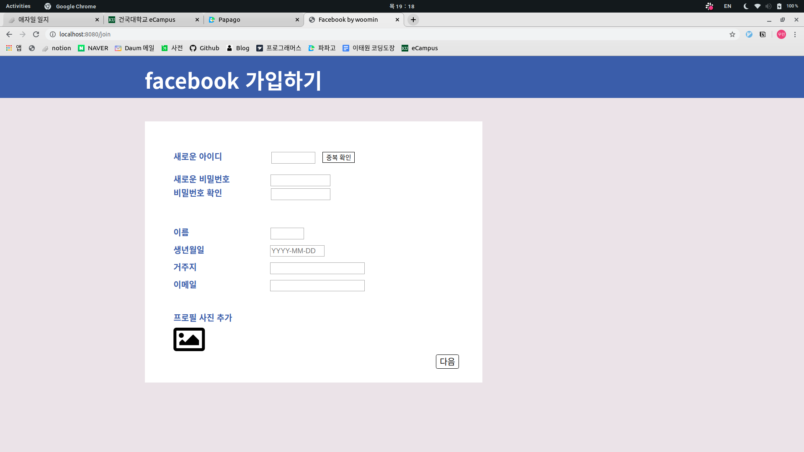
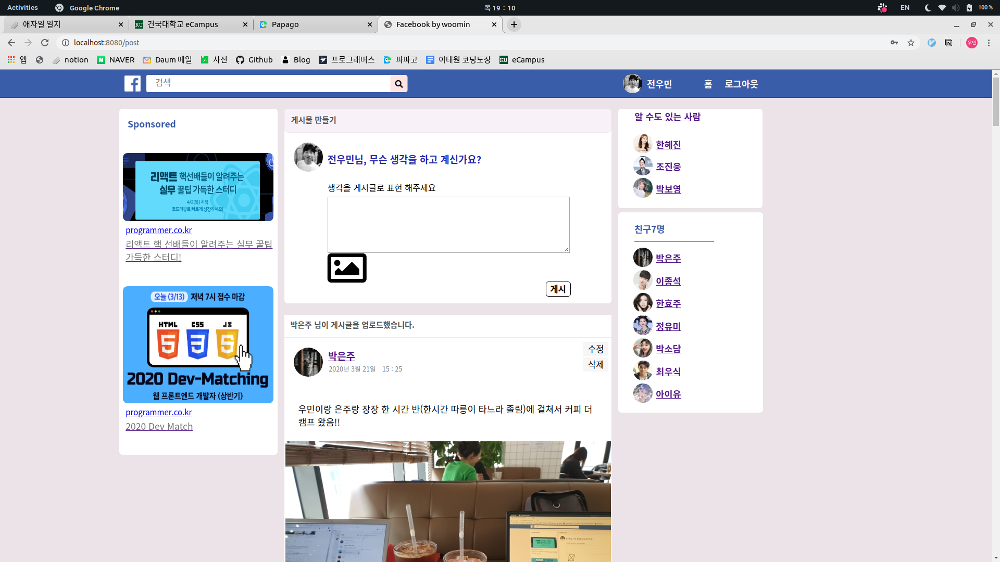
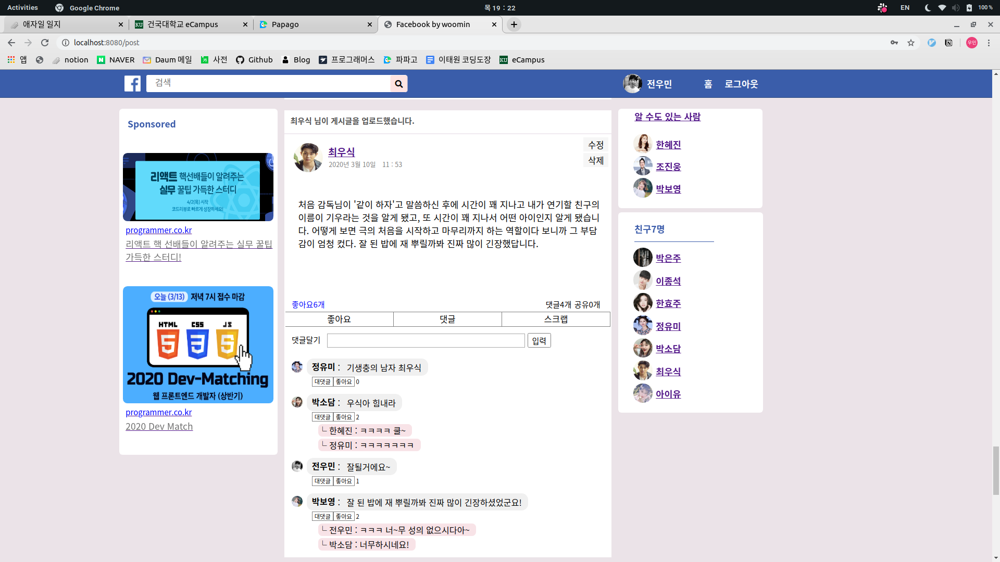
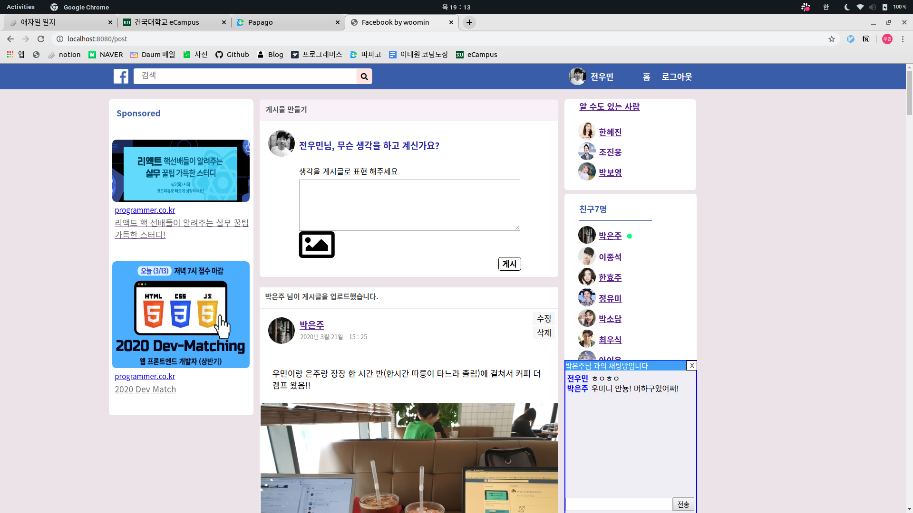
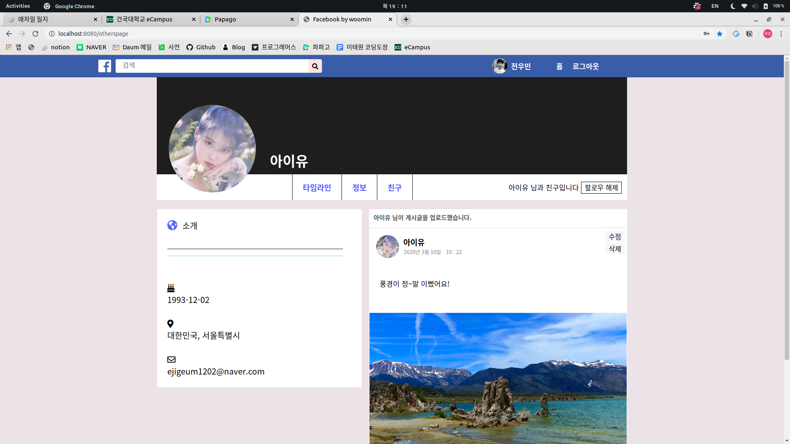
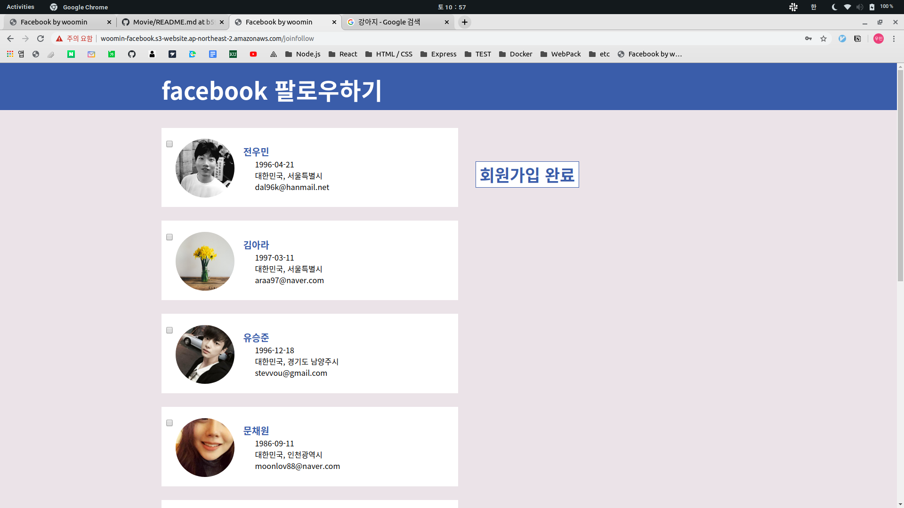

# Facebook

## 웹 사이트 URL

http://woomin-facebook.s3-website.ap-northeast-2.amazonaws.com

 
 
 

## 프로젝트 소개

2020.02.02 ~ 2020.04.21  
Facebook을 클론 코딩한 프로젝트입니다.

 
 
 

## 웹 사이트 화면

|                 로그인                |               가입하기                |
| :-----------------------------------: | :-----------------------------------: |
|     |    |

|               타임라인                |                타임라인               |
| :-----------------------------------: | :-----------------------------------: |
|  |   |

|                1:1 채팅               |               유저 페이지             |
| :-----------------------------------: | :-----------------------------------: |
|  |  |

|               친구 추천               |                 팔로잉                |
| :-----------------------------------: | :-----------------------------------: |
|  |  |

 
 
 

## 구현한 기능

> 로그인 / 로그아웃  
> 회원가입 및 팔로잉  
> 게시글 업로드(사진) / 수정 / 삭제  
> 게시글에 대한 좋아요와 댓글, 대댓글  
> 친구 목록  
> 친구 추천  
> 1:1 채팅  
> 유저 페이지 / 마이 페이지  

 
 
 

## 사용 기술

| **[프론트엔드]**   |                |
| ---------------- | -------------- |
| **ReactJS**      | UI 라이브러리  |
| **React-Router** | 라우팅         |
| **Webpack**      | 번들링         |
| **Axios**        | API 요청       |
 

| **[백엔드]**       |                |
| ---------------- | -------------- |
| **NodeJS**       | API 라이브러리 |
| **MongoDB**      | DataBase       |
| **Sentry**       | 에러 관리      |
| **Winston**      | 에러 로깅      |
 

| **[테스트]**       |                  |
| ---------------- | ---------------- |
| **Jest**         | Unit test        |
| **Supertest**    | Integration test |
| **Enzyme**       | React component test |

 
 
 

**배포**

|                  |         |
| ---------------- | ------- |
| **클라이언트**   | AWS S3  |
| **API 서버**     | AWS EC2 |
| **채팅 서버**    | AWS EC2 |
| **MongoDB**      | Atlas   |
| **이미지 파일**  | AWS S3  |

 
 
 

## 프로젝트 회고
